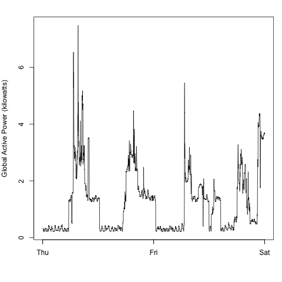
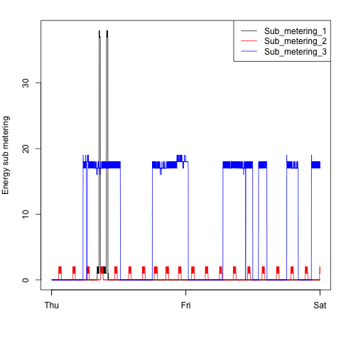
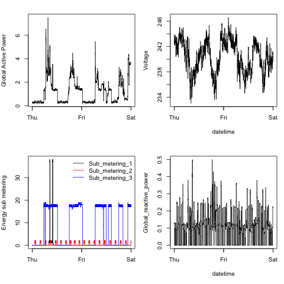

## Introduction

This assignment uses data from
the <a href="http://archive.ics.uci.edu/ml/">UC Irvine Machine
Learning Repository</a>, a popular repository for machine learning
datasets. 

Four plots are created according to the assignment, shown below.

## How to Use
1. Clone this repo to your computer, launch R, and set the working directory to the clone location.

1. Download and unzip the dataset from the following link. Place the resulting .txt file in the clone location.

    <b>Dataset</b>: <a href="https://d396qusza40orc.cloudfront.net/exdata%2Fdata%2Fhousehold_power_consumption.zip">Electric power consumption</a> [20Mb]

1. `source` the following files. Each sourced file reads the dataset if necessary, and then creates a PNG graphic file containing the plot. The resulting PNG files are saved in your working directory.
    * `plot1.R`
    * `plot2.R`
    * `plot3.R`
    * `plot4.R`
    
## Notes
For better performance and in the theme of "don't repeat yourself", each `plotN.R` script calls a common file called `readData.R` _only_ if the dataset needs to be loaded. This allows the data load, which takes several seconds, to happen only once even when running multiple plot scripts. For peer reviewers, if you have questions, please see [this thread](https://class.coursera.org/exdata-007/forum/thread?thread_id=18#post-85) in the Discussion Forums. Thank you.
 
## Outputs    
### Plot 1

 

### Plot 2

 

### Plot 3

 

### Plot 4

 

